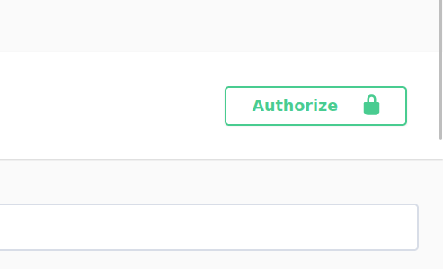

# FactoryBot
## Запуск приложения 
Сначала склонируйте этот проект у себя локально.
Проект использует `poetry` для управления зависимостями.
```shell
poetry install
```
Также у себя локально надо настроить `.env` файл. Все значения
которые потребуются для запуска проекта были указаны в `.env.example`
<br> В `.env` файле в поле `TELEGRAM_BOT_API_KEY` надо добавить API_KEY телеграм бота.
Его можно получить через `BotFather`. Инструкцию смотрите здесь 
https://core.telegram.org/bots/tutorial

Используйте ``` python manage.py runserver``` для запуска приложения.
Затем перейдите по ссылке `http://127.0.0.1:8000/docs/` чтобы ознакомится с API
и документациям к ним.

Для того чтобы отправлять и смотреть свои `messages`, а также создавать токены доступа сначала надо зарегистрироваться. 
После успешной регистрации вы получаете `access_token` который надо будет добавить сюда



Здесь будет поле `value` туда надо добавить это значение `Token <и ваш полученный access_token>` 

Чтобы бот работал локально его тоже надо запустить. Вам надо находиться в директории,
где находится файл `bot.py` и затем запустите команду:

```shell
python bot.py
```

## Развертывание
Настроить `.env.prod` файл(также надо добавить `TELEGRAM_BOT_API_KEY`). 
Потом надо перейти в директорию где находиться Makefile и в терминале прописать команду для запуска docker контейнера
```shell
make
```
